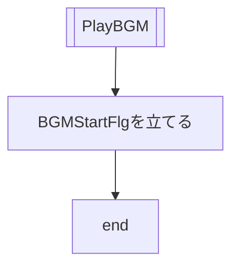
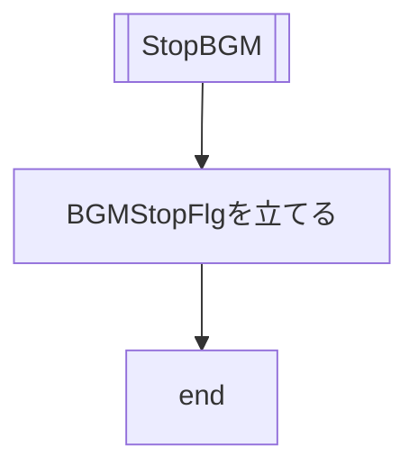
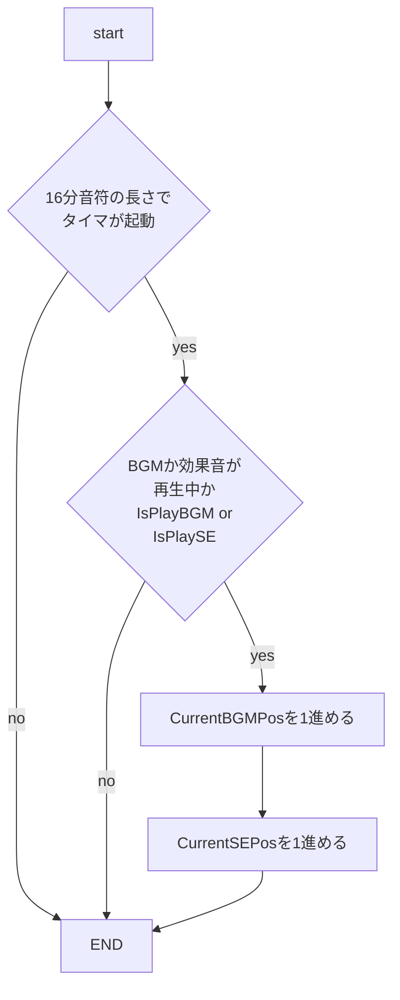
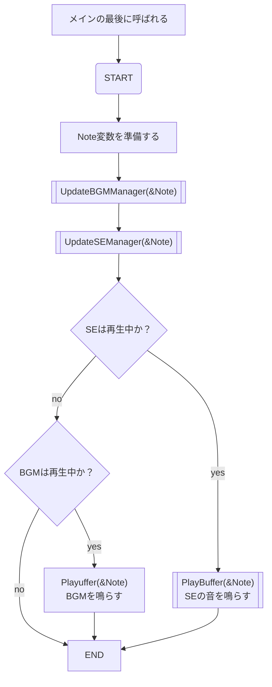
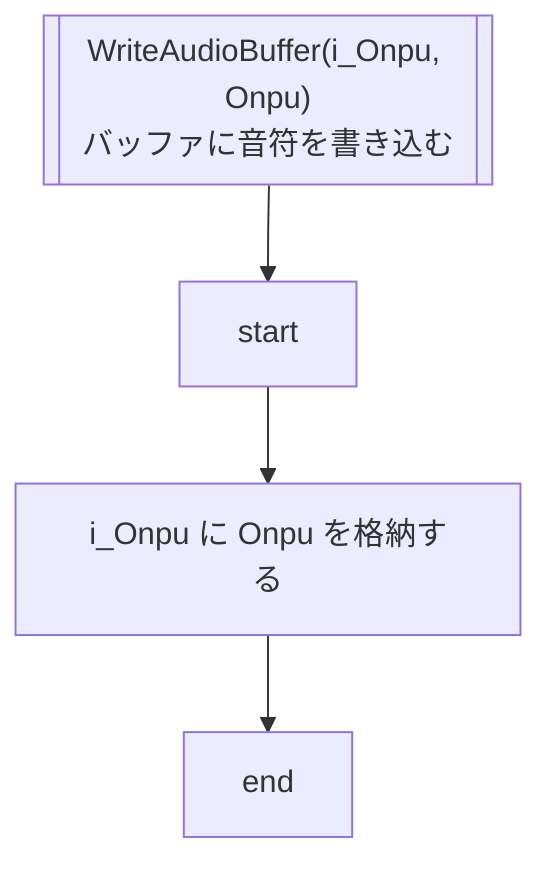
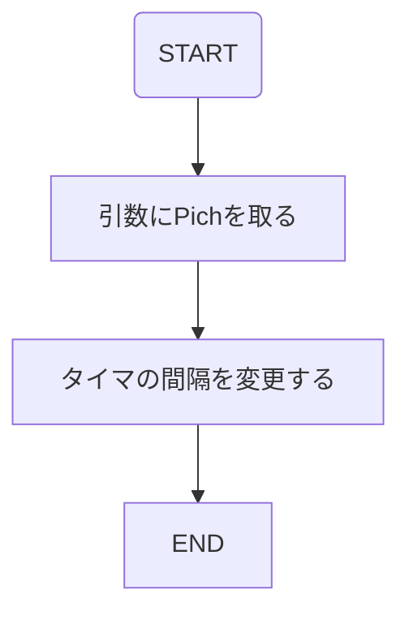
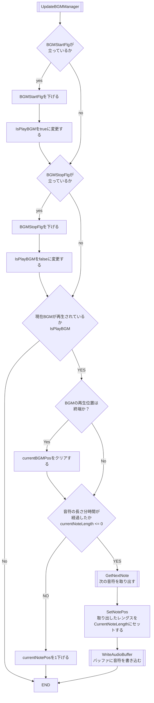
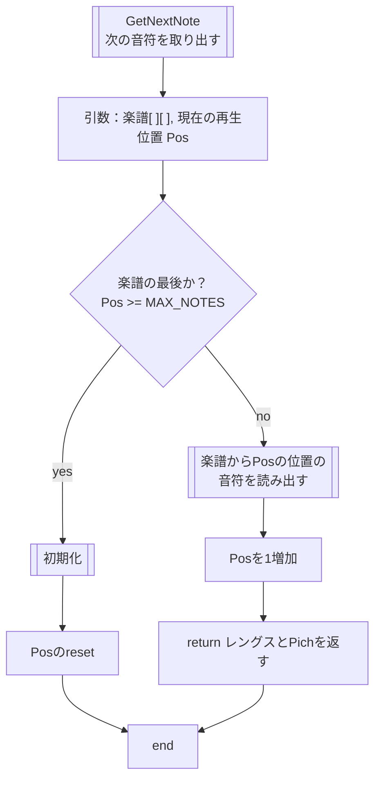

# 仕様 オーディオ

## 説明

- 説明
  - BGMと効果音の2種類がある。
    - BGM
      - システム状態がゲーム中の時、常時曲をループ再生させる。
      - ゲーム開始時にBGMを再生(PlayBGM)し、ゲーム終了時に停止(StopBGM)する。
      - メイン関数で、マネージャーを常に起動させ、再生中か停止中の状態に合わせて再生したり、停止したりする
    - 効果音
      - ゲームが始まる時やモグラを叩いた時など、あるタイミングで決まったパターンのメロディを再生(PlaySE)する。あるタイミングは仕様書の概要シートに記載。
      - BGMが流れていた場合、BGMを消音(MuteBGM)し、効果音を再生した後、再生した分の長さが経過した地点からBGMを再生(UnMuteBGM)する。
      - 効果音が鳴っている最中に再度PlaySEが呼ばれた時、一度効果音を停止（StopSE）し、呼ばれた効果音を最初から再生する。
  - 前提として、BGMと効果音のテンポはどちらも同じものとする
  - テンポに合わせて、最小音符の長さを算出し、その間隔でタイマーを起動させる
    - このタイマーに合わせて、プレイヤーの再生タイミングを表現する
    - BGMが再生中に、効果音が再生した場合、効果音が再生した分、

### 楽譜

- 機能
  - テンポ
  - 音符
    - 音の長さ
    - 音の高さ

### AudioPlayer

- 機能
  - 音符を再生する機能
    - スピーカーに再生させる音符をバッファに入れる
    - バッファの音符を再生させる
  - BGMとSEの再生をそれぞれ管理する機能

### BGMPlayer

- 機能
  - BGMを開始・停止させる
  - 次に再生する音符を出力する

### SEPlayer

- 機能
  - SEを開始・停止させる
  - 次に再生する音符を出力する

## BGM

- 楽譜がある
  - テンポ（分に4分音符が何個か）
  - 音の長さ(16分音符)
    - 全音      16
    - 付点2分   12
    - 2分       8
    - 付点4分   6
    - 4分       4
    - 付点8分   3
    - 8分       2
    - 16分      1
  - 音の高さ
    - 休符 0
    - ド 1
    - レ 2
    - ミ 3
    - ファ 4
    - ソ 5
    - ラ 6
    - シ 7
    - ド 8

- 例
  - ドレミの歌
    - 音階：ド、レ、ミ、レ、ミ、レ、ミ
    - 長さ：付点4分、8分、付点4分、8分、4分、4分、2分
    - 符号化：{{6, 1}, {2,2}, {6, 3},{2, 2}, {4,3}, {4,2}, {8,3}}

- この楽譜は、2次元配列[Pos][Note]を用いる
  - [Pos]の要素は、音符の位置に合わせた音符の情報を
- [Note]要素には、音符の情報として、{長さ、高さ}を表す。
- これを、休符以外であれば、音を再生し、休符であれば、音を再生しないようにすれば良い。

### PWMを制御する間隔

#### ONOFFするタイミング

- PWMのオンオフを切り替えるタイミングは、音符の長さの最小に左右される
- そのため、60テンポ（分4分音符60個）であれば、
  - 1分 = 60秒 = 4分音符60個
  - 1秒 = 4分音符 1個
  - 4分音符 = 8分音符 2個 = 16分音符 4個
  - 1秒 = 16分音符 4個
  - 切り替えるタイミング(f) = 1秒(s) / 4
  - = 0.25s = 250ms

#### 音程を変える

- PWMの間隔（タイマーの間隔）を変更させる

| 音階 | 理論値 |     | 周期時間(us) |     | 割込み間隔(us) |     | 16進数 |
| ---- | ------ | --- | ------------ | --- | -------------- | --- | ------ |
| ド   | 261.63 | Hz  | 3822.191645  | us  | 1911           | us  | 0777   |
| レ   | 293.66 | Hz  | 3405.298645  | us  | 1703           | us  | 06A6   |
| ミ   | 329.63 | Hz  | 3033.704457  | us  | 1517           | us  | 05EC   |
| ファ | 349.2  | Hz  | 2863.688431  | us  | 1432           | us  | 0597   |
| ソ   | 392    | Hz  | 2551.020408  | us  | 1276           | us  | 04FB   |
| ラ   | 440    | Hz  | 2272.727273  | us  | 1136           | us  | 0470   |
| シ   | 493.88 | Hz  | 2024.783348  | us  | 1012           | us  | 03F4   |

## 変数・関数

### 楽譜 SheetMusic構造体

- 説明
  - 再生する音のデータ

- 構造
  - uint8_t Tempo
    - テンポ
  - Data[Pos][Note] 音データが入っている2次元配列
    - Note = {LENGTH, PITCH}
      - LENGTH = 長さ = 定数0
      - PITCH = 高さ = 定数1
  - uint16_t MAX_NOTE
    - 楽譜の長さ（音符の総数）

- 操作関数
  - 次の音符へ移動

### AudioPlayer

- 説明
  - BGMと効果音が適切なタイミングで、競合なく再生されるように制御する

### BGMManager

- 説明
  - BGMを再生する、しないを切り替える
- 変数
  - BGMStartFlg
    - BGMの開始が呼ばれた時のフラグ
    - トリガー
      - ON：ゲーム開始時
      - OFF：メインのAudioPlayerの中
  - NotePos
    - 現在再生中の音符の位置

#### PlayBGM

- 説明
  - BGMを再生する
- トリガー
  - ゲーム開始時
- 処理
  - BGMスタートフラグ(BGMStartFlg)を立てる
  - 引数
    - void
  - 戻り値
    - void

#### StopBGM

- 説明
  - BGMを停止する
- トリガー
  - ゲーム終了時
- 処理

- bool IsPlayBGM
  - 再生しているかどうか
    - true 再生中
    - false 停止中
  - トリガー
    - ON：ゲーム開始
    - OFF：ゲーム終了

- uint16_t Pos
  - 再生している曲の再生位置

- NoteLength16th
  - 説明
    - 16分音符の長さ 単位はms
    - SetSheetMusicがシステム起動時の初期化で呼ばれ、楽譜の16分音符の長さを算出する

- NextBGMUpdateTimming 音更新タイミング
  - 説明
    - 次の音符までの時間
    - タイマでこれが減少する

- SetSheetMusic()
  - 説明
    - 楽譜のセット
    - 楽譜のテンポに合わせて、16分音符の時間を決める
  - タイミング
    - Call：システムの一番最初の初期化の時
  - 処理
    - 楽譜のTempoから、16分音符の長さ(s)を求め、AudioManager_NoteLength16thに格納
      - 16分音符の長さ(s) = 15 / Tempo

- GetNextNote()
  - 説明
    - BGMを現在の位置から再生する
  - 引数
    - void
  - 戻り値
    - void

### SEPlayer

- 変数
  - SelectSE

#### PlaySE()

- 説明
  - 指定した効果音を再生する。
- 引数
  - uint8_t 効果音の番号

#### StopSE()

- 説明
  - 現在再生されている効果音を止める。

## フローチャート

### タイマー

- 説明
  - 16分音符の長さでCurrentPosを進める
  - CurrentPosは、楽譜の最後まで行くと、メインでクリアされる

### AudioPlayer

- 前提条件
  - BGMかSEが再生中の場合に再生する
- 変数
  - ローカルでNote変数を持つ
    - Note[2]
      - Length 0
      - Pich 1

#### WriteAudioBuffer

- 説明
  - AudioBufferのローカルなOnpu変数に、入力されたOnpuデータを格納する

#### PlayBuffer

### BGM

#### UpdateBGMManager

- 説明

- ローカル変数
  - CurrentNotePos
    - 現在の再生位置の音符が16音符でいう何個めか
    - 次の音符を取り出した時にセットする
    - 16音符分の時間が経過したら（CurrentBGMPosが1増えたら)
      - CurrentNotePosを1減らす

### 楽譜

#### GetNextNote

